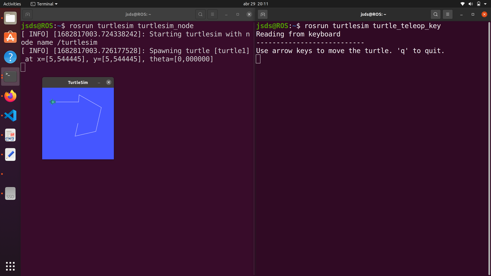

# robotics-lab3
This repo has contains the 3th lab Intro to ROS. The goal of this lab is to set up the environment necesary to start working with ROS and familiarize the participants with its usage.

The version of software used is:
- ROS noetic  
- Ubuntu 2020.4 
- MATLAB 2023a

## How to use it?
Testing the installation by running `roscore` and in a second terminal

```bash
rosrun turtlesim turtlesim_node
```

and in a third

```bash
rosrun turtlesim turtle_teleop_key 
```

## Results


## Analysis results 

## Create package
After [seting up the catkin workspace](http://wiki.ros.org/catkin/Tutorials/create_a_workspace) . We create a basic ROS package

```bash
catkin_create_pkg  robotics-lab3 std_msgs rospy roscpp turtlesim
```

Use the turtlesim package a base for the desired 

```bash
rospack find turtlesim 
#/opt/ros/noetic/share/turtlesim
```


```bash
cd ~/catkin_ws/
catkin_make
```

```bash
roslaunch robotics-lab3 mylaunch.launch 
```

rosnode  info turtle_teleop_key

## Conclusions 
In this lab we explored a powerful tool called ros that allows us to run different parallel processes with different programs and connect between them, its modular structure allows us to make changes in some of them without affecting the others, the use of ros allowed us to modify, in this particular case, the control of a program without altering its code, which opens a large window of opportunities when controlling processes.
## Contributors
- [Juan Sebastian Duenas](https://github.com/jsduenass) (jsduenass@unal.edu.co)
- [German Andres Urbina Gutierrez](https://github.com/gurbinaUn)  (gurbina@unal.edu.co)
- [Brayan Daniel Barrera Galvis](https://github.com/brayandan) (bdbarrerag@unal.edu.co)

## Reference
- [Tutorial para instalar ROS Noetic](https://github.com/fegonzalez7/rob_unal_clase2)
- [turtle sim teleop](https://docs.ros.org/en/melodic/api/turtlesim/html/teleop__turtle__key_8cpp_source.html)
- [reference keycodes](https://css-tricks.com/snippets/javascript/javascript-keycodes/)
- [Create package](http://wiki.ros.org/ROS/Tutorials/WritingPublisherSubscriber%28c%2B%2B%29)
