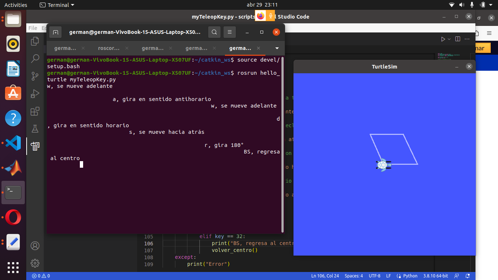

# robotics-lab3
This repo has contains the 3th lab Intro to ROS. The goal of this lab is to set up the environment necesary to start working with ROS and familiarize the participants with its usage.

The version of software used is:
- ROS noetic  
- Ubuntu 2020.4 
- MATLAB 2023a

Testing the installation by running `roscore` and in a second terminal

```
rosrun turtlesim turtlesim_node
```

and in a third

```
rosrun turtlesim turtle_teleop_key 
```



## Contributors
- [Juan Sebastian Duenas](https://github.com/jsduenass) (jsduenass@unal.edu.co)
- [German Andres Urbina Gutierrez](https://github.com/gurbinaUn)  (gurbina@unal.edu.co)
- [Brayan Daniel Barrera Galvis](https://github.com/brayandan) (bdbarrerag@unal.edu.co)

## Reference
- [Tutorial para instalar ROS Noetic](https://github.com/fegonzalez7/rob_unal_clase2)